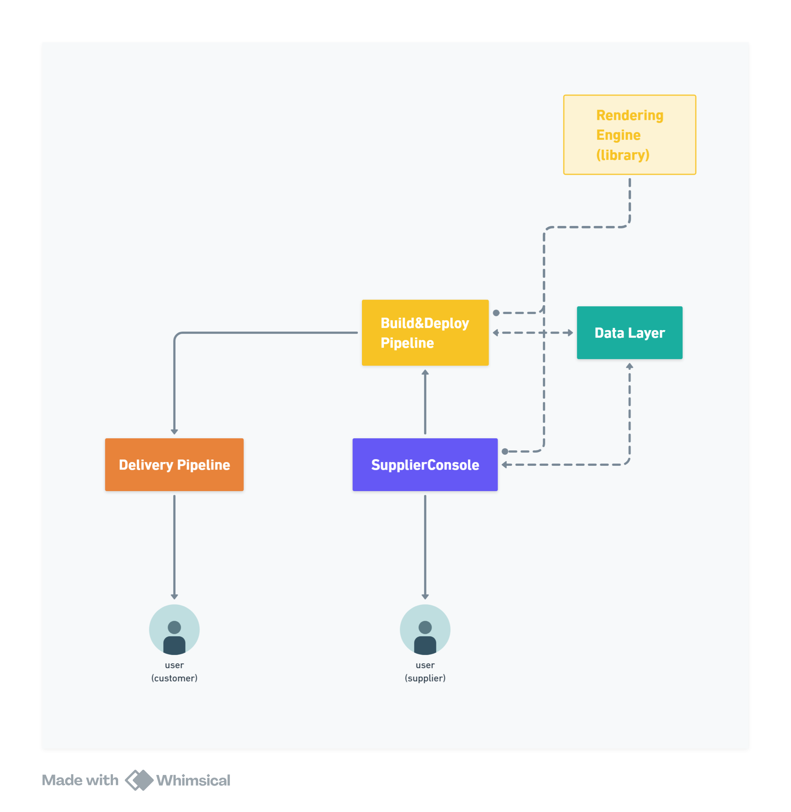

# flexy-monorepo

このリポジトリは、**ホームページ自動構築プラットフォーム**を構成する複数のサービスを一元的に管理する Monorepo です。  
各サービスは独立した責務を持ちながら、Cloudflare・Google Cloud 上で疎結合に連携し、  
ユーザーがノーコードでサイトを生成・配信できるアーキテクチャを実現しています。

---

## 🗺️ System Overview

このシステムは以下の主要コンポーネントから構成されます：

| コンポーネント | 役割 |
|----------------|------|
| **Rendering Engine (library)** | UI レンダリングを担当するライブラリ。テンプレートやデザイン構成を入力として、静的/動的 HTML を生成。 |
| **Build & Deploy Pipeline** | Rendering Engine を利用してビルドを行い、成果物を Cloudflare へデプロイするパイプライン。 |
| **Supplier Console** | サイト提供者（事業者）が構成・テーマ・デザインを設定する管理コンソール。 |
| **Delivery Pipeline** | 最終成果物をユーザーへ配信。Cloudflare Workers / KV / R2 上でホストされる。 |
| **Data Layer** | Cloud SQL と Cloud Storage により設定・成果物・ログを一元管理。 |

> 各モジュールは API / Cloud Task を通じて疎結合に連携します。  
> Host-based Routing により、各テナント（顧客サイト）ごとに独立した配信ルートを形成します。

---

## ⚙️ Architecture Summary

### Rendering Engine
- 構成: TypeScript 製 Solid向け ライブラリ
- 主な特徴:
  - Declarative Rendering Pipeline
  - Compositional Rendering Architecture
  - Part / Block / Layout 層の分離
- 入力: 設定ファイル
- 出力: Solidコンポーネント

### Build & Deploy Pipeline
- Cloud Run Jobs によりビルドタスクを非同期実行。
- 成果物は Delivery Pipeline 管轄のCloudflare R2に転送。
- テナントと独自ドメインの紐づけ設定をCloudflare KVに保存。

### Supplier Console
- サイト構成・ページデザイン・モーションなどを編集可能な管理 UI。
- Cloud Run API 経由で Build & Deploy Pipeline を制御。
- Identity Platform による認証を利用。

### Delivery Pipeline
- Cloudflare Workers による配信エッジ。
- Cloudflare KV (構成キャッシュ) と R2 (静的ファイル) を使用。
- Host-based Routing により顧客ごとに独立したサイトを提供。
